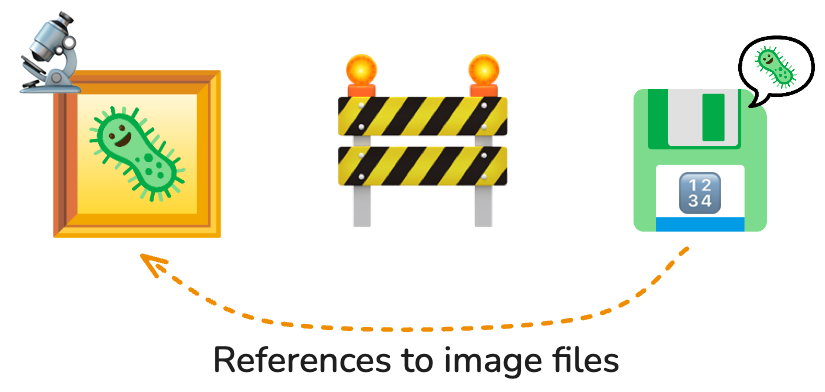
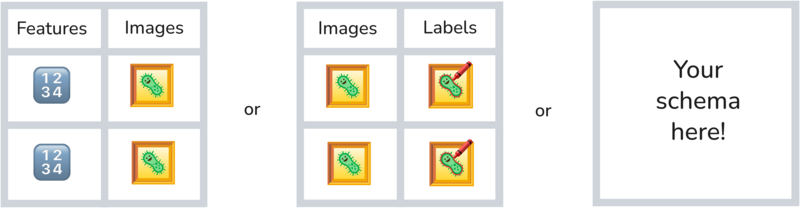
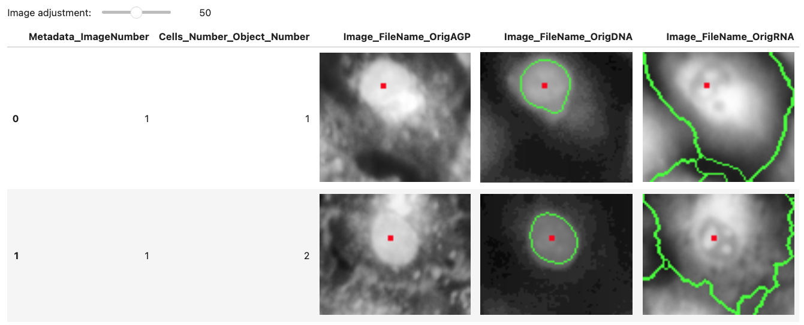
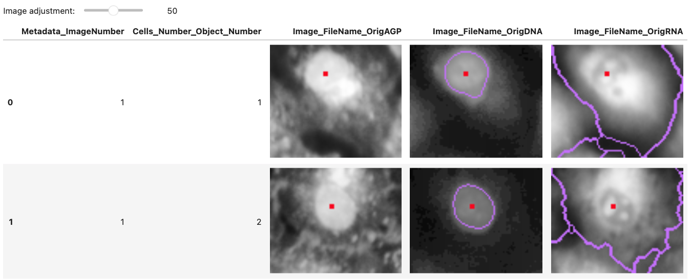

## Why OME-Arrow?

{width=100% fig-align="center"}

Modern bioimaging workflows increasingly combine **images**, **metadata**, and
**derived measurements** across many tools and platforms.
When those components are split across incompatible formats, analysis becomes
harder to query, harder to reproduce, and harder to scale.
**OME-Arrow** applies **Open Microscopy Environment (OME)** conventions through
**Apache Arrow** so imaging data can participate directly in modern analytical
workflows.

## An interoperable image data model

{width=100% fig-align="center"}

By representing image content as **Arrow-compatible structures** alongside
metadata and features, OME-Arrow enables:

- **Programmatic access** across Python and other Arrow-compatible tools
- **Relational workflows** using SQL engines, DuckDB, and Parquet pipelines
- **Consistent storage** for pixels, metadata, and derived features
- **Standards alignment** with the broader open bioimaging ecosystem

## Supported workflows

OME-Arrow supports practical data movement across common microscopy formats and
downstream analysis environments:

- **Ingest** from TIFF, OME-Zarr, and NumPy arrays
- **Export** to OME-Parquet, OME-Zarr, and OME-TIFF
- **Lazy scan-style access** for large datasets
- **Tensor pathways** for machine learning and zero-copy style workflows
- **Visualization** through `napari-ome-arrow`
- **Feature-centric workflows** through `CytoDataFrame`

## Using OME-Arrow in Python

### Install

```bash
# install OME-Arrow from PyPI
pip install ome-arrow
```

### Ingest an image and inspect it

```python
from ome_arrow import OMEArrow

# Ingest a TIFF image into an OME-Arrow object.
oa_image = OMEArrow(data="your_image.tif")

# Access the Arrow-compatible image record.
oa_image.data

# Summarize metadata and dimensions.
oa_image.info()
```


### Export to interoperable formats

```python
# Export one image to OME-Parquet.
oa_image.export(how="ome-parquet", out="your_image.ome.parquet")

# The same object can also be exported to OME-Zarr or OME-TIFF.
oa_image.export(how="ome-zarr", out="your_image.ome.zarr")
oa_image.export(how="ome-tiff", out="your_image.ome.tiff")
```



### Work lazily with large data

```python
from ome_arrow import OMEArrow

# Build a deferred plan from OME-Parquet.
oa = OMEArrow.scan("your_image.ome.parquet")

# Queue lazy spatial slicing, then collect.
cropped = oa.slice_lazy(0, 512, 0, 512).slice_lazy(64, 256, 64, 256).collect()

# Create a tensor view for machine learning workflows.
arr = cropped.tensor_view(t=0, z=0, layout="CYX").to_numpy()
```



## Integration with the ecosystem

OME-Arrow is intentionally modular and complements other open-source bioimaging
tools rather than replacing them.

- **`napari-ome-arrow`** enables interactive visualization of OME-Arrow and
  OME-Parquet data in napari.
- **`CytoDataFrame`** brings OME-Parquet image and feature data into
  DataFrame-centered notebook workflows.
- **`coSMicQC`** can operate on feature-rich datasets that are paired with image
  context through Cytomining ecosystem tools.

### Read OME-Parquet created for feature workflows

```python
from ome_arrow import OMEArrow

# Read one image from a multi-image OME-Parquet table.
oa_image = OMEArrow(
    data="BR00117006.ome.parquet",
    column_name="Image_FileName_OrigDNA_OMEArrow_LABL",
    row_index=2,
)

# Display with a standard visualization backend.
oa_image.view(how="matplotlib")
```


## Why this matters

OME-Arrow offers a **standards-aligned**, **queryable**, and
**language-agnostic** way to keep imaging data connected to the metadata and
measurements that scientists actually analyze.
This makes it easier to move between image storage, tabular analytics,
interactive visualization, and machine learning without inventing a new data
model for each tool.

## Acknowledgements

We thank those who have inspired, contributed, or helped support OME-Arrow and
the broader open bioimaging ecosystem:

- Open source science from the [__Open Microscopy Environment__](https://github.com/ome)
- The communities behind [__Apache Arrow__](https://arrow.apache.org/),
  [__napari__](https://napari.org/), and Cytomining ecosystem projects
- Members of the [__Way Lab__](https://www.waysciencelab.com/) at the University of Colorado Anschutz Medical Campus
- [__Department of Biomedical Informatics__](https://medschool.cuanschutz.edu/dbmi) within the School of Medicine at the University of Colorado Anschutz Medical Campus
